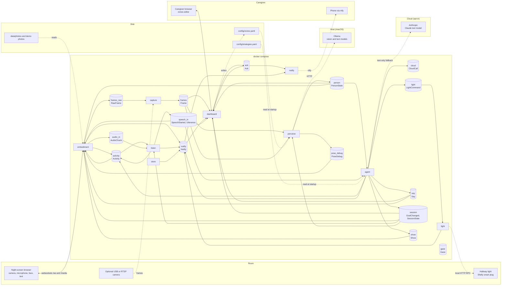
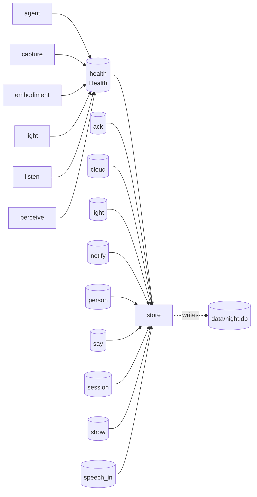

<!-- Generated by nc_shared.archdoc. Do not edit by hand. -->
# As-built architecture

This document is generated from the event registry and service source. Regenerate it with:

```sh
python -m nc_shared.archdoc --write
```

## Data flow

Solid arrows carry runtime data. Dotted arrows are direct connections to the outside world.
The diagram deliberately shows unconnected streams and services: they are not implemented yet.



## Health and persistence

Health traffic and persistence are separated from the main diagram to keep its data path readable.



## Streams

| Stream | Events | Published by | Read by (consumer group) | Capped |
| --- | --- | --- | --- | --- |
| `ack` | `Ack` | dashboard | dashboard (`dashboard-live`), notify (`notify`), store (`store`) | no |
| `activity` | `Activity` | agent, embodiment, listen | embodiment (`embodiment`), listen (`listen-activity`) | yes, 200 |
| `audio_in` | `AudioChunk` | embodiment | listen (`listen`) | yes, 50 |
| `cloud` | `CloudCall` | agent | store (`store`) | no |
| `frames` | `Frame` | capture | dashboard (`dashboard`), perceive (`perceive`), perceive (`perceive-calibrate`) | yes, 50 |
| `frames_raw` | `RawFrame` | embodiment | capture (`capture`) | yes, 50 |
| `gaze` | `Gaze` | nobody yet | nobody yet | yes, 50 |
| `health` | `Health` | agent, capture, embodiment, light, listen, perceive | dashboard (`dashboard-live`), store (`store`) | no |
| `light` | `LightCommand` | agent | light (`light`), store (`store`) | no |
| `notify` | `Notify` | agent, embodiment, light, listen, store | dashboard (`dashboard-live`), notify (`notify`), store (`store`) | no |
| `person` | `PersonState` | perceive | agent (`agent`), dashboard (`dashboard-live`), embodiment (`embodiment`), store (`store`) | no |
| `pose_debug` | `PoseDebug` | perceive | embodiment (`embodiment`) | yes, 50 |
| `say` | `Say` | agent | dashboard (`dashboard-live`), embodiment (`embodiment`), store (`store`) | no |
| `session` | `GoalChanged`, `SessionState` | agent | dashboard (`dashboard-live`), embodiment (`embodiment`), listen (`listen-session`), perceive (`perceive-session`), store (`store`) | no |
| `show` | `Show` | agent | embodiment (`embodiment`), store (`store`) | no |
| `speech_in` | `SpeechStarted`, `Utterance` | listen | agent (`agent`), dashboard (`dashboard-live`), embodiment (`embodiment`), store (`store`) | no |

## Outside-world connections

These connections do not use Redis streams, so they are declared in the generator and checked
against the files that implement them.

| Service | Outside thing | Direction | Declared at |
| --- | --- | --- | --- |
| `embodiment` | Browser page, websockets `/ws` and `/media` | both | `services/embodiment/embodiment/app.py` |
| `embodiment` | Photos under `data/photos` and demo photos | reads | `services/embodiment/embodiment/app.py` |
| `embodiment` | Consented family WAV clips under `data/voice-clips` | reads | `services/embodiment/embodiment/app.py` |
| `embodiment` | Piper voice model and ephemeral generated WAV cache | reads/writes | `services/embodiment/embodiment/tts.py` |
| `embodiment` | `config/strategies.yaml` and `config/person.yaml` for speech warming | reads | `services/embodiment/embodiment/tts.py` |
| `capture` | USB or RTSP camera, optional | reads | `services/capture/capture/sources.py` |
| `perceive` | Ollama `/api/generate` on the host | calls | `services/perceive/perceive/vision.py` |
| `perceive` | `config/zones.yaml` at startup | reads | `services/perceive/perceive/zones.py` |
| `listen` | faster-whisper model cache; downloads `small.en` on first use | reads/writes | `services/listen/listen/transcribe.py` |
| `agent` | `config/strategies.yaml` at startup | reads | `services/agent/agent/strategies.py` |
| `agent` | Consented family WAV headers under `data/voice-clips` | reads | `services/agent/agent/strategies.py` |
| `agent` | Ollama `/api/generate` on the host | calls | `services/agent/agent/llm.py` |
| `agent` | OpenAI-compatible local server on the host (e.g. `mlx_lm.server`), opt-in | calls | `services/agent/agent/llm.py` |
| `agent` | Anthropic Messages API, text-only and opt-in | calls | `services/agent/agent/llm.py` |
| `notify` | ntfy topic, or the log when `NTFY_URL` is empty | calls | `services/notify/notify/backends.py` |
| `light` | Shelly Gen2+ smart plug on the local LAN, optional | calls | `services/light/light/backends.py` |
| `store` | SQLite `data/night.db` | reads/writes | `services/store/store/main.py` |
| `dashboard` | Caregiver browser, HTTP Basic auth | both | `services/dashboard/dashboard/app.py` |
| `dashboard` | `config/zones.yaml` | writes | `services/dashboard/dashboard/app.py` |
| `dashboard` | SQLite `data/night.db` event history | reads | `services/dashboard/dashboard/history.py` |
