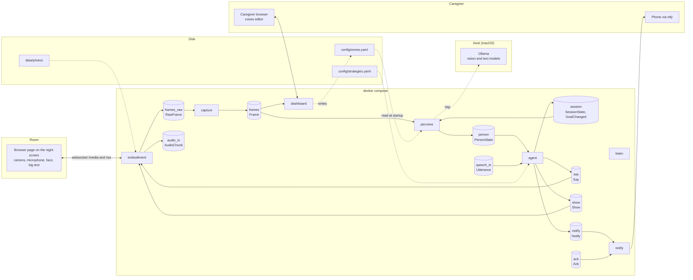

# Visualisation plan: a self-updating map of the services

Status: built. Written 2026-09-10 as a plan; `ARCHITECTURE.md` is now
generated by `python -m nc_shared.archdoc --write` and checked by
`shared/tests` (see CLAUDE.md). The plan below is kept for the reasoning.

## 1. What this is for

The system is eight containers that only ever talk to each other through
Redis streams. Nothing is hard to understand on its own, but there is no
single picture of who sends what to whom, and the one drawing in PLAN.md
(section 4) shows the intended design rather than what is built.

This plan adds one file, `ARCHITECTURE.md`, that holds that picture. The
file is never edited by hand. A small program reads the code and writes it,
and a test fails whenever the code and the picture disagree. So the picture
can be trusted even by someone who does not read the code.

Decisions already taken with the owner:

- The picture lives in the repo as Mermaid text. GitHub renders Mermaid as a
  real diagram, so opening `ARCHITECTURE.md` on GitHub shows the drawing.
- It is generated from the code, and a test fails when it is stale.
- It shows everything: the services, the streams between them, the event
  types on each stream, and the outside world (browser, camera, Ollama,
  ntfy, SQLite, config files).

## 2. What you will see in `ARCHITECTURE.md`

Four parts, top to bottom.

### 2.1 The main picture: how data flows

Services are boxes. Streams are cylinders, labelled with the stream name and
the event types that travel on it. The outside world sits in dashed groups
around the edge. Below is a hand-drawn mock of what the generator will
produce from today's code, so the shape can be judged before anything is
written.



Two things stand out in the mock and are correct, not bugs. `listen` has no
arrows because it is still a stub (issue #18): nobody publishes `Utterance`
yet and nobody reads `audio_in` yet. Likewise nobody publishes `Ack` yet.
The picture shows what is built. See open question 7.1 for showing planned
connections as dashed arrows.

### 2.2 The second picture: health and persistence

Every service publishes `Health`, and `store` reads every stream except the
three capped media streams. Drawing those arrows on the main picture would
add about fifteen edges and hide the real flow, so they get their own small
diagram: all services pointing at `health`, `store` reading the seven
persisted streams, and `store` writing `data/night.db`.

### 2.3 A table of every stream

One row per stream, generated from the same data as the diagrams:

| Stream | Events | Published by | Read by | Capped |
| --- | --- | --- | --- | --- |
| frames_raw | RawFrame | embodiment | capture | yes, 50 |
| frames | Frame | capture | perceive, dashboard | yes, 50 |
| audio_in | AudioChunk | embodiment | nobody yet | yes, 50 |
| person | PersonState | perceive | agent, store | no |
| speech_in | Utterance | nobody yet | agent, store | no |
| session | SessionState, GoalChanged | agent | perceive, store | no |
| say | Say | agent | embodiment, store | no |
| show | Show | agent | embodiment, store | no |
| notify | Notify | agent | notify, store | no |
| ack | Ack | nobody yet | notify, store | no |
| health | Health | every service | store | no |

This is the "event types on each arrow" detail without cluttering the
drawing.

### 2.4 A table of outside-world connections

The bus is the only thing between services, but each service also touches
something outside the bus: the browser, Ollama, ntfy, SQLite, config files.
These do not go through the event registry, so they cannot be discovered
the same way. They are declared in one small table inside the generator,
each with a pointer to the file that makes the connection, and rendered as
a table plus the dashed groups on the main picture.

| Service | Outside thing | Direction | Declared at |
| --- | --- | --- | --- |
| embodiment | Browser page, websockets `/ws` and `/media` | both | services/embodiment/embodiment/app.py |
| embodiment | Photos under `data/photos` and demo photos | reads | services/embodiment/embodiment/app.py |
| capture | USB or RTSP camera, optional | reads | services/capture/capture/sources.py |
| perceive | Ollama `/api/generate` on the host | calls | services/perceive/perceive/vision.py |
| perceive | `config/zones.yaml` at startup | reads | services/perceive/perceive/zones.py |
| agent | `config/strategies.yaml` at startup | reads | services/agent/agent/strategies.py |
| notify | ntfy topic, or the log when `NTFY_URL` is empty | calls | services/notify/notify/backends.py |
| store | SQLite `data/night.db` | writes | services/store/store/main.py |
| dashboard | Caregiver browser, HTTP Basic auth | both | services/dashboard/dashboard/app.py |
| dashboard | `config/zones.yaml` | writes | services/dashboard/dashboard/app.py |

## 3. How it stays up to date

### 3.1 Where the facts come from

The exploration on 2026-09-10 confirmed that everything needed is already
in the code in a regular shape:

- `shared/nc_shared/events.py` has `EVENT_STREAMS`, one dict mapping each
  event class to its stream name. This is the single source of truth for
  streams and event types.
- Every service goes through `Bus.publish(event)` and
  `Bus.ensure_group(stream, group)` plus `Bus.read(...)`. No service calls
  Redis directly.
- Every service names its streams as module-level constants
  (`FRAME_STREAM = "frames"`) or as string literals inside
  `ensure_group("show", GROUP)`. The only dynamic case is `store`, which
  computes `PERSISTED_STREAMS = sorted(set(EVENT_STREAMS.values()) -
  CAPPED_STREAMS)`.
- The events a service publishes are always constructed inside that
  service's own source, for example `Health(source=...)` or
  `say_event = Say(...)` followed by `bus.publish(say_event)`.

### 3.2 The generator

A new module `shared/nc_shared/archdoc.py`, standard library plus
`nc_shared.events` only. Run as `python -m nc_shared.archdoc --write` from
the repo root. It does four things.

1. Loads `EVENT_STREAMS` to learn every stream and its event types.
2. Parses every `.py` file under `services/<name>/<name>/` with Python's
   `ast` module, skipping `tests/`. Test files construct events they never
   publish, so they must not count.
3. Finds subscriptions: the first argument of every `ensure_group(...)`
   call. A string literal is taken as is. A name is resolved to its
   module-level assignment. That assignment is evaluated in a tiny
   namespace containing only `EVENT_STREAMS`, `set`, `sorted` and string
   sets, which is exactly enough for `store`'s computed list.
4. Finds publications: every event class from the registry that is called
   as a constructor anywhere in the service's non-test source. That gives
   the right answer for all eight services today. `agent` imports
   `PersonState` and `Utterance` for type checks but never constructs
   them, so they are correctly not listed as published.

The one rule that makes the output trustworthy: when the generator cannot
resolve something, it fails with the file and line, and the test fails
with it. It never guesses and never silently drops an edge. Concretely:

- an `ensure_group` argument it cannot resolve is an error;
- a service whose source contains `.publish(` but constructs no event
  class is an error ("cannot tell what X publishes");
- a stream named by a service that is not in `EVENT_STREAMS` is an error,
  which also catches typos in stream names for free.

For the rare genuine exception, the generator has an `OVERRIDES` dict where
a service can be given an explicit publish or subscribe list with a
one-line reason. It starts empty.

The outside-world table (section 2.4) is a hand-maintained dict in the same
module. To keep even that honest, the test checks that every file path it
points at still exists, so a moved or deleted file fails the test.

### 3.3 The output

`ARCHITECTURE.md` at the repo root, starting with a banner saying it is
generated and how to regenerate it. Mermaid diagrams use quoted labels and
prefixed node ids (`s_` for services, `q_` for streams) so that a stream
and a service with the same name, like `notify`, never collide. Output is
sorted so re-running produces byte-identical text.

### 3.4 The test

`shared/tests/test_architecture_doc.py`, one test: generate in memory,
compare with the committed file, and on mismatch fail with the message

```
ARCHITECTURE.md is out of date. Run:  python -m nc_shared.archdoc --write
```

A second test asserts the generator raises on an unresolvable
`ensure_group` argument, using a small synthetic service written to a temp
directory, so the fail-loud rule is itself tested.

Where it runs. The shared package has `pytest` in its `dev` extra and
`testpaths = ["tests"]` already, but no tests directory yet. Service images
copy only their own service, so this test needs the whole checkout. The
host machine has Python 3.9 and no pytest, and the project prefers
containers over host virtualenvs, so the documented command is:

```sh
docker run --rm -v "$PWD":/repo -w /repo python:3.12-slim \
  sh -c "pip install -q -e shared[dev] && pytest shared/tests"
```

There is no CI today. When one is added, this is the first check to put in
it. Until then the test is part of the definition of done for any change
that adds an event, a stream, or a service.

### 3.5 Day-to-day workflow

When a change adds or removes an event, a stream, a subscription or an
outside connection, the agent making that change also runs the generator
and commits the new `ARCHITECTURE.md` in the same PR. The test enforces
this. The owner only ever opens `ARCHITECTURE.md` on GitHub.

## 4. Files to add or change

| File | Change |
| --- | --- |
| `shared/nc_shared/archdoc.py` | New. Extractor, renderer, `--write` and `--check` entry points. |
| `shared/tests/test_architecture_doc.py` | New. Freshness test and fail-loud test. |
| `ARCHITECTURE.md` | New, generated. |
| `README.md` | One sentence linking to `ARCHITECTURE.md` next to the PLAN.md and HANDOFF.md links. |
| `CLAUDE.md` | Short section: what the file is, that it is generated, the regenerate and test commands, and that every PR touching events or subscriptions must regenerate it. |
| `HANDOFF.md` | Add "ARCHITECTURE.md regenerated if events or subscriptions changed" to the definition of done. |
| `PLAN.md` | One line under the section 4 drawing: that drawing is the intended design, `ARCHITECTURE.md` is the as-built picture. The drawing itself stays. |

No service code changes. Nothing changes at runtime.

## 5. Execution steps

Small enough for one issue and one PR.

1. Write `archdoc.py` extractor and check its output by hand against the
   table in section 6 of this plan. Any difference is either a bug in the
   extractor or a fact this plan got wrong; both are worth knowing.
2. Write the Mermaid and table renderer. Paste the output into a GitHub
   gist or PR description to confirm it renders. Mermaid is unforgiving
   about reserved words and unquoted labels.
3. Write the two tests. Run them with the docker one-liner.
4. Generate `ARCHITECTURE.md`, update the four docs, run `ruff format` and
   `ruff check` on the new module.
5. Open the PR. The reviewer checks one thing above all: does the picture
   match what they know about the system, and if not, which is wrong.

Definition of done: the test passes, GitHub renders both diagrams, and a
deliberate edit to a stream constant makes the test fail with the message
in section 3.4.

## 6. Ground truth found during exploration

Kept here so the implementer can check the extractor against it. All
line numbers are as of commit e93d0cc.

| Service | Publishes (constructed in source) | Subscribes (`ensure_group`) | Where |
| --- | --- | --- | --- |
| capture | Frame, Health | frames_raw | sources.py:21-22,60; main.py:129,159 |
| perceive | PersonState, Health | frames, session | main.py:55-56,323; scene_notes.py:35-36,219 |
| listen | Health | none | main.py:37 |
| agent | SessionState, Say, Show, Notify, GoalChanged, Health | person, speech_in | main.py:86-89,455-456; publishes at 226,259,276,293,297,382,400 |
| embodiment | RawFrame, AudioChunk | show, say (literals) | app.py:181-182,231,257 |
| notify | none | notify, ack | main.py:38-40,96-97 |
| store | none | all streams minus frames, frames_raw, audio_in | main.py:33-34,54-55 |
| dashboard | none | frames | app.py:55-57,144 |

Streams and events, from `EVENT_STREAMS`: frames (Frame), frames_raw
(RawFrame), person (PersonState), speech_in (Utterance), session
(SessionState, GoalChanged), say (Say), show (Show), notify (Notify), ack
(Ack), audio_in (AudioChunk), health (Health). Twelve event classes, eleven
streams.

## 7. Open questions for the owner

7.1 Planned connections. Today the picture will show `listen` with no
arrows and `speech_in`, `audio_in` and `ack` with a missing side, because
those parts are not built yet. That is honest but looks broken. Option: a
small hand-maintained `PLANNED` list in the generator, drawn as dashed grey
arrows labelled with the issue number (listen reads audio_in and publishes
speech_in, #18; notify and dashboard publish ack). Recommendation: yes,
because a reader should be able to tell "not built yet" from "broken".

7.2 Groups on the second picture. `store` and `health` get their own
diagram (section 2.2). Alternative: leave them out of the diagrams
entirely and rely on the table. Recommendation: keep the small second
diagram, it is cheap and shows that a dead service is visible to `store`.

7.3 Consumer groups. Each subscription has a group name (`perceive`,
`perceive-session`, `dashboard`). They matter for debugging with
`redis-cli` but not for understanding the flow. Recommendation: put them in
the stream table as a fourth column, not on the drawing.

7.4 A hosted copy. The owner chose the repo-only option. If a nicer,
zoomable page for a phone or a caregiver is ever wanted, the same generator
can emit HTML and it can be published as an Artifact on request. Not part
of this plan.
