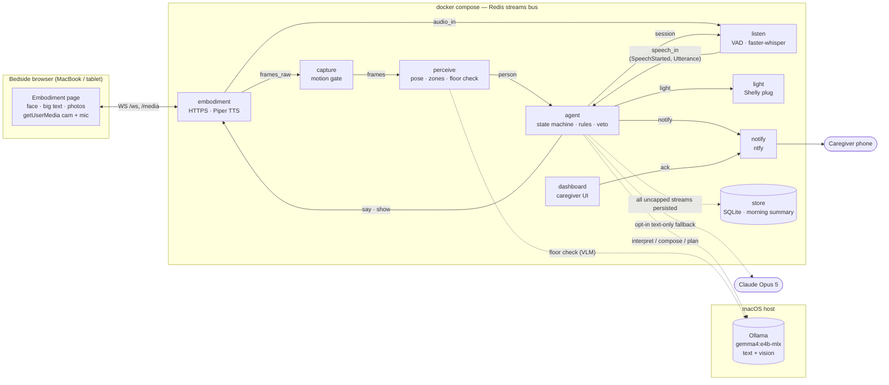
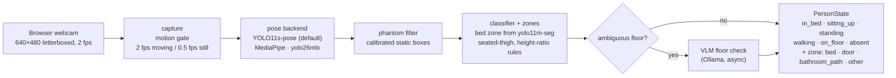
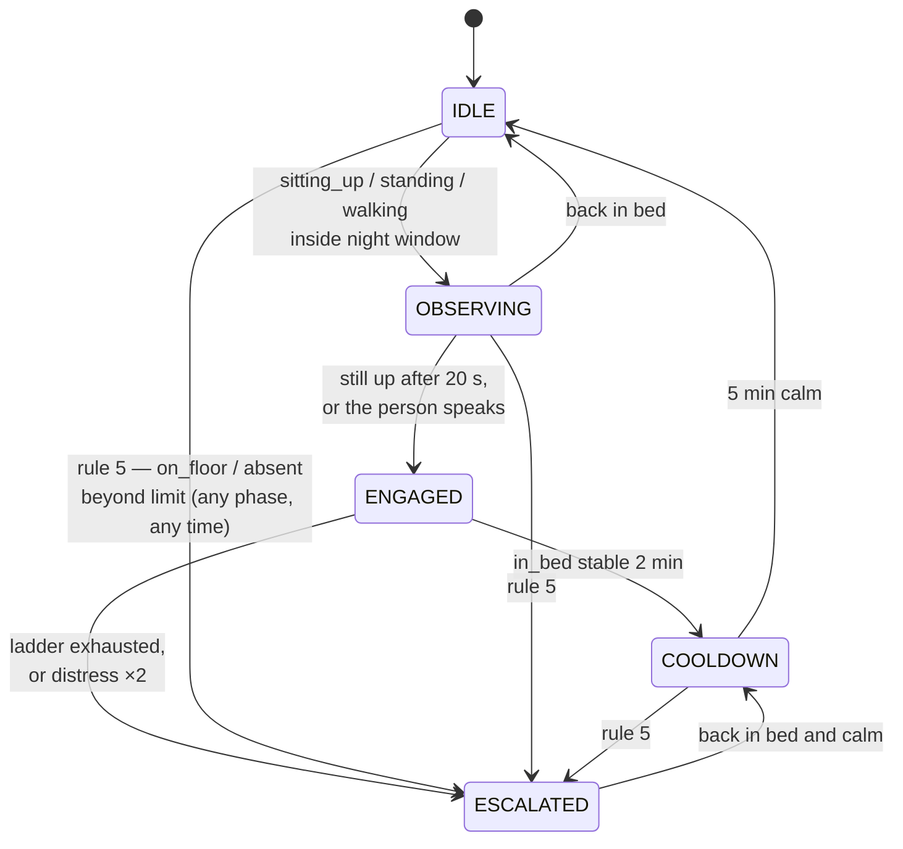
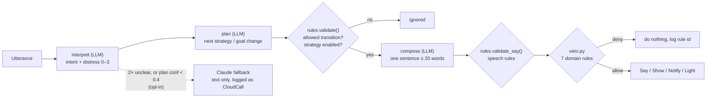
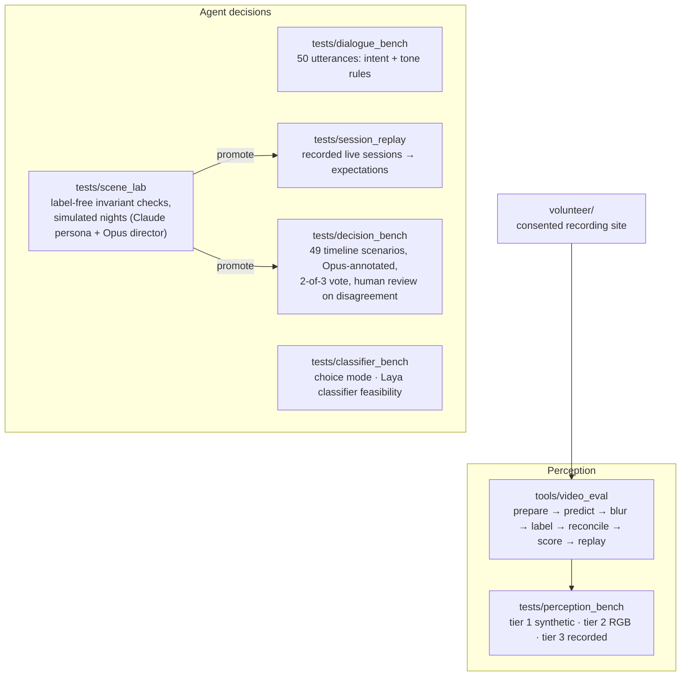

# Night Companion: project status and how it works

Snapshot of `main` at `93f896a` (PR #85 merged), 2026-09-23. This is a
point-in-time summary for orientation. [PLAN.md](../PLAN.md) holds the design,
[HANDOFF.md](../HANDOFF.md) the rules and contracts, and
[ARCHITECTURE.md](../ARCHITECTURE.md) the generated as-built map. Where this
file and those disagree, trust those.

## 1. What it is

A local, always-on bedside agent for a person living with dementia at home.
When the person wakes at night and gets up, it:

1. notices (camera + pose model),
2. opens a **session** with the goal *get safely back to bed*,
3. talks to them through a calm on-screen face and voice to reorient them,
4. changes the goal when there is a real need (restroom, pain, comfort),
5. alerts the family caregiver by phone when nudging fails or there is a risk
   (fall, left the room).

Everything runs on one M4 Mac (16 GB): Docker services plus Ollama on the host.
Frames and audio never leave the box or reach disk. The only thing that can
leave is an opt-in, text-only Claude fallback. It is not a medical device.

## 2. Architecture

Every service is a container. They talk **only** through Redis streams. No
service calls another directly.

| Stream | Event(s) | Producer → main consumers | Capped |
|---|---|---|---|
| `frames_raw` | RawFrame | embodiment → capture | 50 |
| `frames` | Frame | capture → perceive, dashboard | 50 |
| `audio_in` | AudioChunk | embodiment → listen | 50 |
| `person` | PersonState | perceive → agent, embodiment, dashboard, store | – |
| `pose_debug` | PoseDebug | perceive → embodiment (debug overlay) | 50 |
| `speech_in` | SpeechStarted, Utterance | listen → agent, embodiment, store | – |
| `session` | SessionState, GoalChanged | agent → listen, perceive, embodiment, store | – |
| `say` / `show` | Say / Show | agent → embodiment, store | – |
| `notify` | Notify | agent + any faulting service → notify, dashboard, store | – |
| `ack` | Ack | dashboard → notify, store | – |
| `light` | LightCommand | agent → light, store | – |
| `cloud` | CloudCall | agent → store (exact payload sent to Claude) | – |
| `activity` | Activity | agent, embodiment, listen → debug overlay, scene_lab | 200 |
| `health` | Health | every service, every 30 s → dashboard, store | – |

Event models and the stream registry live in `shared/nc_shared/events.py`.

## 3. How a night works

### 3.1 Perception

States are debounced (confirm frames) and published on change or as a 60 s
heartbeat. `walking` and sticky bed occupancy are opt-in (#62).

### 3.2 Session lifecycle (deterministic, `agent/rules.py`)

Goals: `return_to_bed` (default), `restroom`, `drink_water`, `comfort`,
`wait_for_caregiver`. Entering `restroom` (stated need, or a confirmed
door/bathroom-path zone) turns the hallway light on and switches to
`path_light`. Coming back switches to `guided_return` and turns the light off.

### 3.3 Strategy ladder

Tried in order while `ENGAGED`. Each strategy emits `Show`, optionally `Say`,
dwells, and moves on if the person makes no progress toward bed.
Caregivers edit the ladder in `config/strategies.yaml`.

| # | Strategy | Status |
|---|---|---|
| 1 | `ambient_orient`: dim screen, time, "It is night", name | ✅ |
| 2 | `soft_greeting` | ✅ |
| 3 | `orient_time_place`: room photo | ✅ |
| 4 | `validate_and_redirect`: LLM-composed | ✅ |
| 5 | `guided_return` | ✅ |
| 6 | `familiar_voice`: consented family clip | ✅ off by default |
| 7 | `music_or_story` | ❌ no upload path |
| 8 | `path_light`: restroom goal only | ✅ behind `LIGHT_ENABLED` |
| 9 | `escalate_gentle` | ❌ needs hardware (v2) |
| 10 | `escalate_phone`: forced on `ESCALATED` | ✅ |
| – | `acknowledge_return`, `reassure_waiting` (reply-only) | ✅ |

### 3.4 Where the LLM sits, and what stops it

The LLM never owns safety. It proposes, and deterministic code decides.

- **Speech rules** (HANDOFF rule 3): one sentence, then at least 8 s of
  silence. No memory-testing questions. Never "no", "you can't" or "you're
  wrong".
- **Veto layer** (`services/agent/agent/veto.py`, `docs/VETO.md`, #79): a pure
  check that can only deny, never substitute. It runs before every Show, Say,
  Notify and LightCommand. Its 7 rules came from 16 unsafe choices the local
  model made confidently in a probe: e.g. TOIL-01 blocks `guided_return`
  after a stated toilet need, NICE-05 stays silent when the person is
  settling, VAL-01 blocks memory questions, and AA-03 blocks night orientation
  in daytime.
- **Model:** `gemma4:e4b-mlx` on host Ollama, chosen on the dialogue bench
  (#66, `EXPERIMENTS.md`). The perceive floor check uses the same model, so
  one copy fits in 16 GB.

### 3.5 Voice and face

- **In:** `listen` hears nothing in `IDLE`. From `OBSERVING` on, it runs
  WebRTC VAD + Silero to gate faster-whisper `small.en` (CPU). Barge-in fires
  `SpeechStarted` on sustained, verified speech, before transcription
  finishes.
- **Out:** `embodiment` turns `Say` into Piper WAVs (`en_US-lessac-medium`,
  0.85 speed), with fixed phrases pre-rendered at startup. The audio is served
  over HTTPS and never touches Redis.
- **Face:** today, a simple animated face with large text. PR #86 (open)
  replaces it with glowing eyes that react to posture, speech and alerts and
  follow the person through a new `Gaze` stream.

### 3.6 Caregiver side

`dashboard` (port 8444, Basic auth) has these pages: Tonight (live status,
ack), History, Profile, Strategies, Media (photos, consented voice clips),
Zones editor and System (retention, export, delete, dry-run indicator).
`notify` sends alerts through ntfy at three levels: info, attention, and
critical, which repeats until acknowledged. `store` keeps 90 days in SQLite
and sends a morning summary.

## 4. Evaluation and tooling

Recordings, frames, labels and scene_lab runs live outside git, in
`../data-ai-agent-dementia/`. Only face-blurred, verified frames of the
owner's own test clips ever go to a cloud model.

## 5. Where things stand

### Done

- **M0–M3 and M5 are met.** M4 is met except issue #27, the two-week
  volunteer dry run. `DRY_RUN=true` and `docs/DRY_RUN.md` are ready for it.
- **Perception accuracy work on RGB clips:** letterboxed 640×480 bridge (#52),
  YOLO11s-pose + height-ratio floor rule (#55), segmented bed zone +
  seated-thigh rule (#60), MLX pose backend (#61), walking and sticky bed
  (#62, opt-in).
  - README results, on 2 clips (so indicative only): per-frame agreement
    0.78–0.90, scripted events 9/9 and 11/11 with no false events, both floor
    events caught with no false alarms, and 12–60 ms per frame.
- **Agent quality tooling (last week):**
  - decision_bench grew to 49 scenarios with a 2-of-3 Opus annotator vote
    (#71–#78). A local annotator was tested and rejected: 27% agreement with
    Opus.
  - Choice mode plus the veto layer (#79). In choice mode, gemma4 had 0%
    critical violations but did not beat the majority baseline on labelled
    decisions (83.3% vs 86.5%). Its confidence carried no signal.
  - Live desk testing brought a debug overlay, `session_replay` and fixes to
    startup, echo and barge-in (#80).
  - scene_lab phases 0–5 (#85).
- **Volunteer recording site** built (#64, #65).

### Known problems (from `tests/scene_lab/BASELINE.md`)

1. **Questions go unanswered.** 17 of 58 checked utterances got no reply.
   Utterances the interpreter can't map to a goal ("Where am I?", "Tom? Are
   you there?") are often followed only by the next ladder step.
2. **Replies are too slow live.** From end of speech to playback: p50 5.5 s,
   p95 7.5 s, against a 5 s target. STT takes 1.2–4.1 s, and each of one or
   two LLM calls takes 1.5–2.5 s.
3. **The camera starts the restroom goal late.** perceive does not publish on
   a zone change alone, and the agent needs 3 confirming readings.

### Open or next

- PR #86 (bedside eyes), open for review.
- PRs #81–#83 (debug controls, operator session reset, answering a person
  who is up during COOLDOWN, no return-to-bed nudges in bed) were merged
  into `live-pipeline-debugging`, **not `main`**. That branch still needs a
  PR into `main`.
- Issue #27: the two-week volunteer dry run.
- A dark / infrared recording round. Nothing has been validated in IR yet, so
  pose-backend robustness in the dark and under blankets is untested.
- scene_lab `--hours 4` batch. It is still outstanding because simulated
  nights hit the subscription session limit.
- classifier_bench Phase 1+: a local Laya multilingual classifier (11 ms on
  the ANE in Phase 0) as a fast decision layer.
- Product calls for the project owner: whether a smart plug is in v1,
  `walking` as a product state, and the contents of the morning summary.
- Not built: `music_or_story`, in-home chime, bed or door sensors,
  multi-room, Dutch.

## 6. Where to look

| Need | File |
|---|---|
| Design rationale | `PLAN.md` |
| Rules, contracts, decisions | `HANDOFF.md` |
| As-built streams (generated) | `ARCHITECTURE.md` |
| Running, TLS, testing without hardware | `CLAUDE.md` |
| Agent core | `services/agent/agent/{session,rules,strategies,veto,llm}.py` |
| Perception | `services/perceive/perceive/{classify,backends,zones,floor_check}.py` |
| Model measurements | `EXPERIMENTS.md`, `docs/CLASSIFIER_BENCH.md` |
| Video evaluation | `docs/VIDEO_EVAL.md`, `tools/video_eval/README.md` |
| Live-agent bug baseline | `tests/scene_lab/BASELINE.md` |
